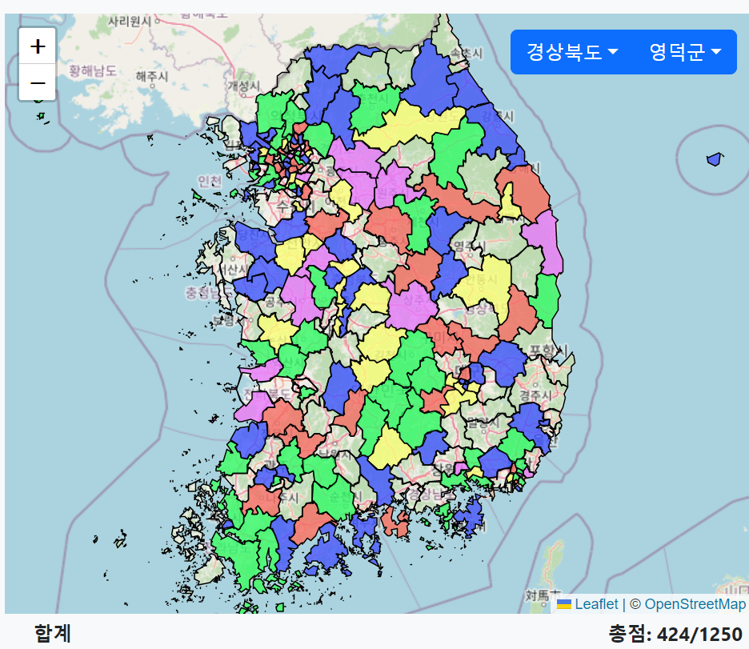

# 대한민국 어디까지 가봤니

 방문한 지역 지도 그리기

<a href="kkn.esclick.net" align="center">

<b>kkn.esclick.net</b>
</a>

## 목적
- 대한민국 기초자치단체 백지도에 다녀온 것을 표시한다.
- [경현치(経県値)](https://uub.jp/kkn/) 사이트를 보고 영감을 얻어 만들었다.
- 비슷한 사이트가 존재하나, [광역자치단체 단위](https://debugger-net.github.io/keikenchi-kor/map.html)거나, [기능이 단순](https://play.google.com/store/apps/details?id=com.tripgrida.app.koreanbeen&gl=US)하며, 지도 레이어를 사용하지 않았다. 그래서 이 프로젝트를 진행하게 되었다. 
- 14시간 소요

## 기능
- 각 지역에 대해 내가 0점부터 5점까지 점수를 매길 수 있다.
    - 지도에서 행정구역을 여러 번 클릭하거나, 아래 표를 클릭한다.
- 선택된 지역은 아래 표시된다.
- 지역 이름을 클릭한 경우 지도가 해당 지역으로 움직인다.
- 사이트의 url을 복사해서 현재 상태를 저장하고 공유할 수 있다.

## 참고
- [대한민국 SHP 경계 파일](www.gisdeveloper.co.kr/?p=2332)을 QGIS 플러그인을 통해 단순화시킨 뒤, geojson으로 출력하였다.
- 이를 [Leaflet.js](https://leafletjs.com/index.html)를 통해 시각화하였다.
- 빠른 디자인을 위해 [Bootstrap](https://getbootstrap.com/)을 사용하였다.
- Github pages를 통해 호스팅하였다.
